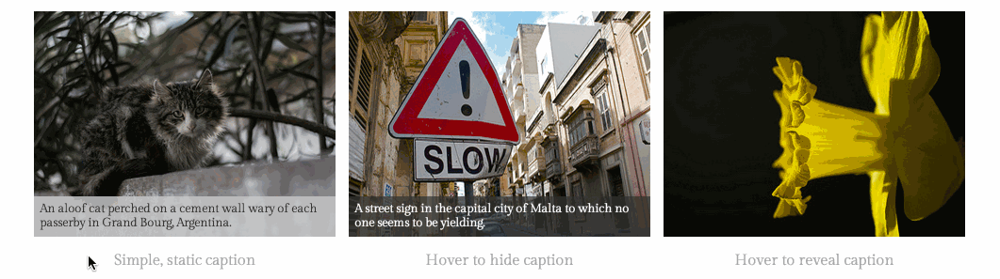

# captionss

Sensible CSS Image Captions

## Why captionss?

- Uses nothing more than CSS3 and HTML5, no JavaScript needed.
- No need to specify image sizes ahead of time, even works with dynamically
  sized images.
- Lots of caption styles can be achieved with the simple set of options.

## Usage

Documentation used to be hosted on an external website. That site is now
defunct and squatted.

## Contributing

I would love for the community to contribute to this project, but until I
figure out guidelines for doing so, it might be best to just submit an issue
to kick off a discussion about your potential contribution.

If you do happen to submit a pull request, I won't hold it against you.

## License

&copy; 2014 [Josh Branchaud](http://joshbranchaud.com)

And obviously, licensed under the MIT license (see `LICENSE` for details).
